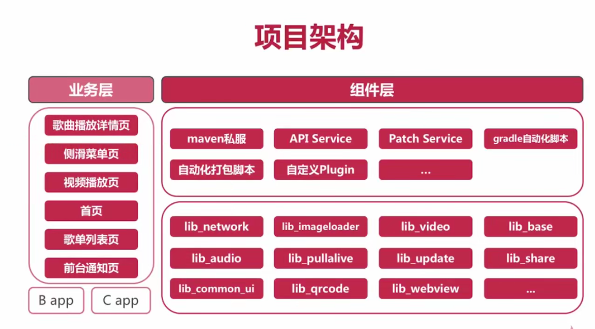
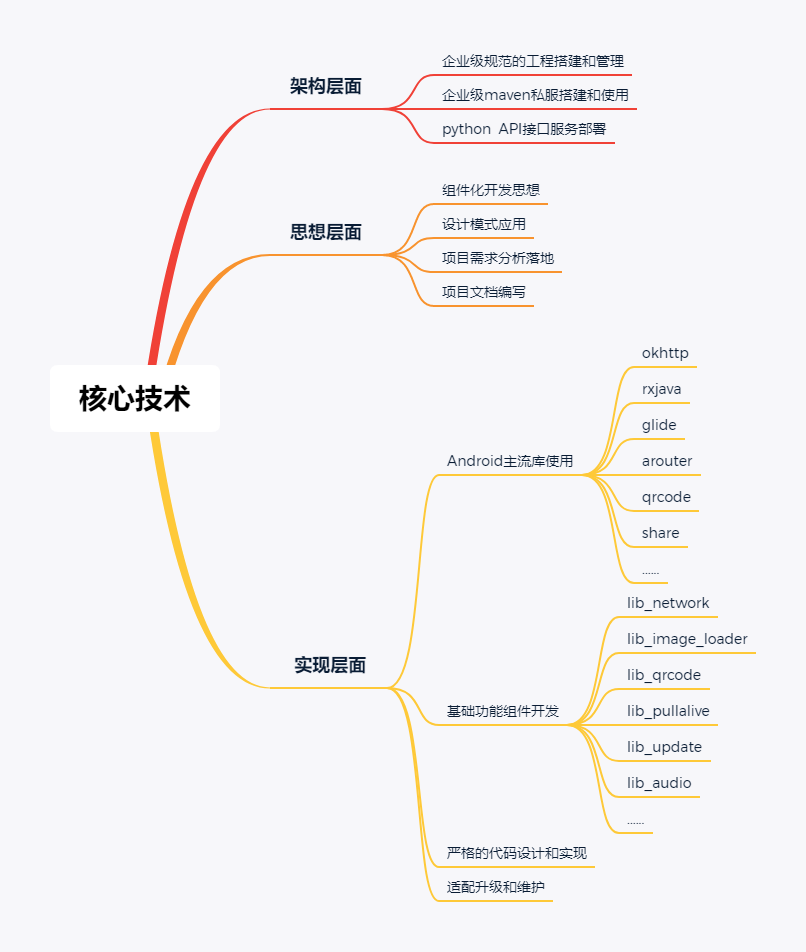
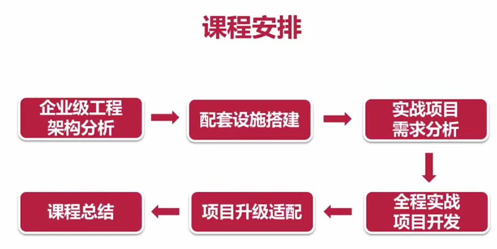

## 企业级App的架构与设计

### 内容

+ 慕课云音乐App
  + 对企业级app的架构有深入的认识
  + 迈出架构的第一步
  + 体验一线互联网公司工作流程和方式
  + 成为知名企业更青睐的开发者

### 项目架构

### 核心技术

### 课程安排

### 章节安排

+ 以最终目标为驱动

+ 分析需求及设计思路，实现功能

+ 总结收获与作业扩展

  

### 课程收获

+ 1、掌握企业级的应用开发核心技术
+ 2、掌握组件化开发应用的核心思路
+ 3、掌握原生app体验交互实现原理
+ 4、掌握适配最新api和androidx结构
+ 5、掌握app整体架构的设计和实现
+ 6、配套资料&增值服务