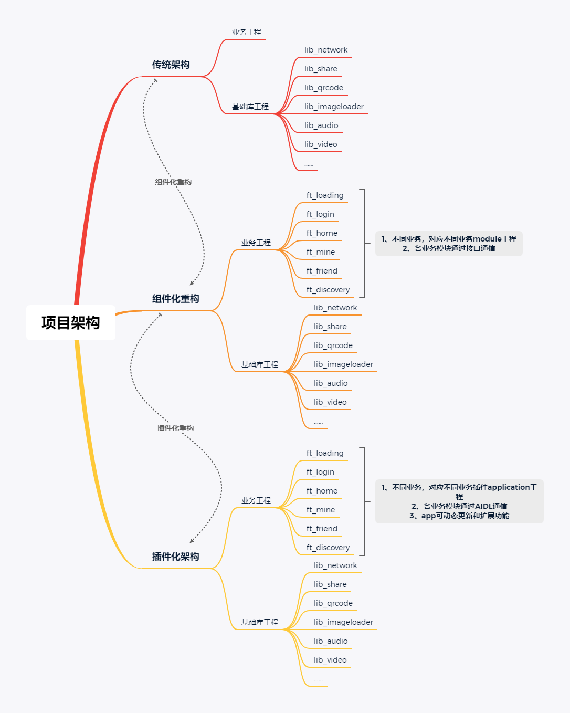
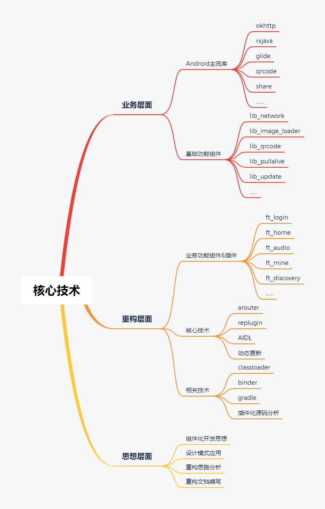
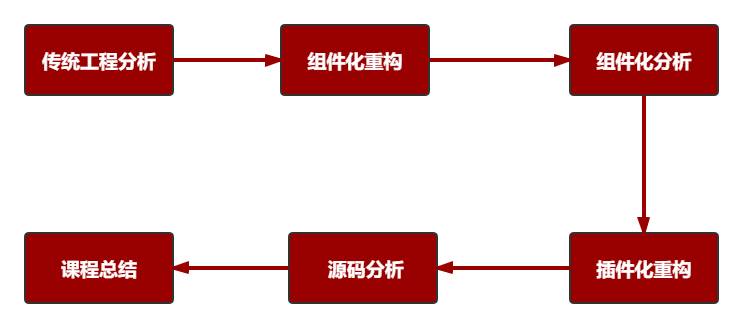

## 课程介绍

+ 1、基于模块化，以组件化和插件化为核心

+ 2、具体的项目
+ 3、在代码上和工程结构上都有很强的可扩展性和可维护性
+  

### 目的

+ 1、了解一线公司企业级架构

+ 2、拥有对不合理架构进行重构能力

+ 3、对App架构有极致追求

+ 4、成为高级工程师

+ 5、成为架构师

  

### 项目架构

### 核心技术

### 课程安排

### 章节安排

+ 以最终目标为驱动

+ 分析需求及重构思路，完成重构

+ 总结收获与作业扩展

  

### 课程收获

+ 掌握企业级重构所用到的核心技术
+ 掌握合理划分组件或插件的能力
+ 提高自己解决问题的能力
+ 加深对Android framework理解
+ 提升对不合理架构的重构能力
+ 配套资料丰富&增值服务