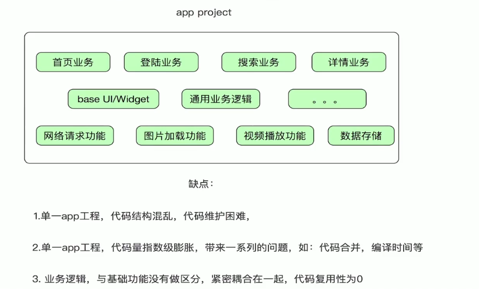
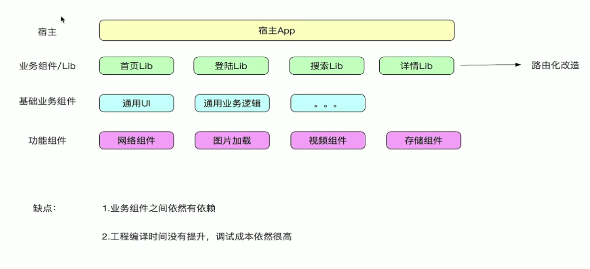
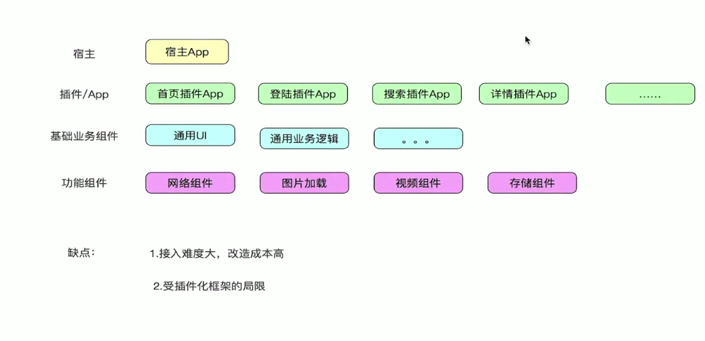

## 企业级App重构之路

### 内容划分

+ 1、传统App工程结构分析

+ 2、组件化工程结构分析

+ 3、插件化工程结构分析

  

### 传统App工程结构分析

+ 因此出现了从传统“模块化”到“组件化”的改造！

  

### 组件化工程结构分析

+ 虽然有缺陷，但是分层结构很便于代码扩展。

  

### 插件化工程结构分析

### 工程结构总结

+ 传统App结构-->组件化重构阶段-->插件化重构阶段

